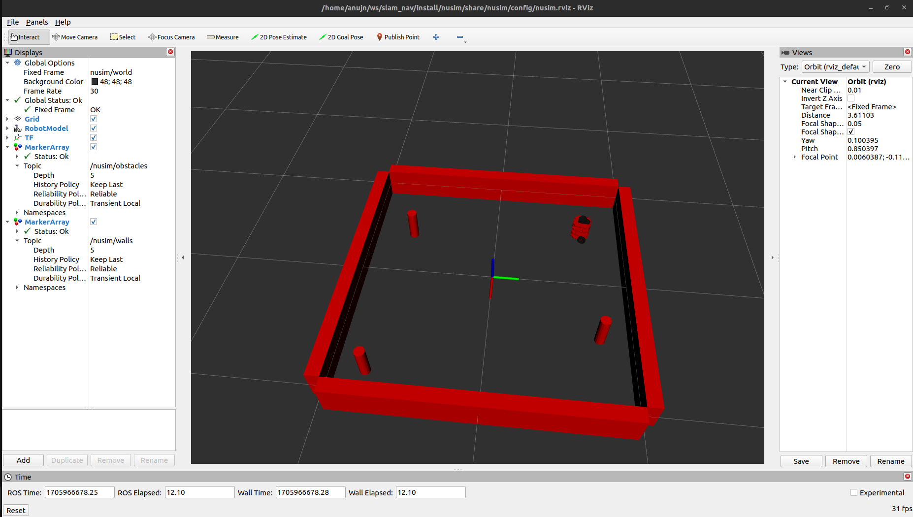

# Nusim

### Package description
The package that simulates the turtle_bot in RViz.

### Launchfile Description
* `ros2 launch nusim nusim.launch.xml` to run the launchfile.

### Parametes
* `rate` (int): Rate of the simulation in Hz.
* `x0` (double): Rate of the simulation in Hz.
* `y0` (double): Rate of the simulation in Hz.
* `theta0` (double): Rate of the simulation in Hz.
* `arena_x_length` (double): Rate of the simulation in Hz.
* `arena_y_length` (double): Rate of the simulation in Hz.
* `obstacles_x` (std::vector<double>): Rate of the simulation in Hz.
* `obstacles_y` (std::vector<double>): Rate of the simulation in Hz.
* `obstacles_r` (double): Rate of the simulation in Hz.

### Image
