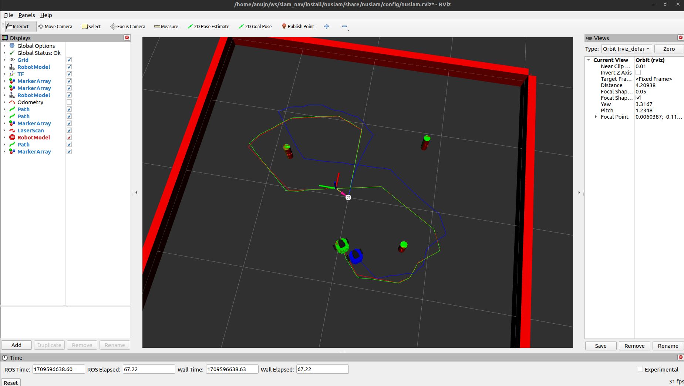

# Nuslam

Main package that runs the green turtle odometry and slam

* `ros2 launch nuslam slam.launch.xml` to Launch the robot and the ndes to control it. Has 3 arguments.

    * `cmd_src` has 3 options ['circle', 'teleop', 'none'] which select the control source of the robot, i.e. circle node, teleop keys and none. 

    * `robot` has 3 options ['nusim', 'localhost', 'none'] which select the which robot runs, i.e. on simulation, the real robot and none. 

    * `use_rviz_4` has 2 options ['true', 'false'], which select whether or not rviz is being used.

Below is an image of the slam implementation

