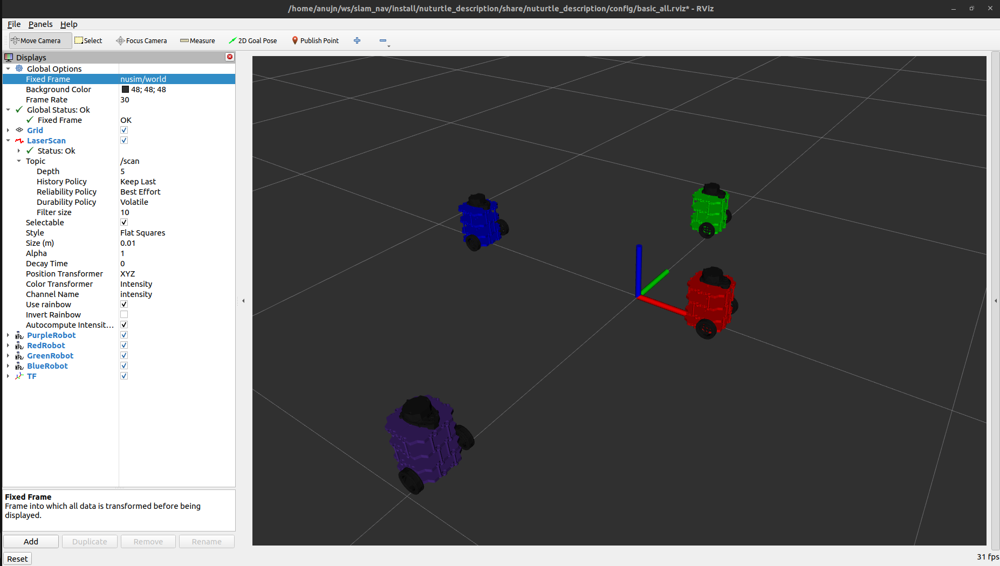

# Nuturtle  Description

URDF files for Nuturtle Paul

* `ros2 launch nuturtle_description load_one.launch.py` to see the robot in rviz.

* `ros2 launch nuturtle_description load_all.launch.xml` to see four copies of the robot in rviz.



* The rqt_graph when all four robots are visualized (Nodes Only, Hide Debug) is:


# Launch File Details
* `ros2 launch nuturtle_description load_one.launch.py --show-args` for arguments of load_one.launch.py

    ```
    Arguments (pass arguments as '<name>:=<value>'):

    'use_rviz':
        Launch rviz. Valid choices are: ['true', 'false']
        (default: 'true')

    'use_jsp':
        Enable joint_state_publisher_node. Valid choices are: ['true', 'false']
        (default: 'true')

    'color':
        Select the color of the turtlebot base model. Valid choices are: ['purple', 'red', 'blue', 'green', '']
        (default: 'purple')
    ```

* `ros2 launch nuturtle_description load_all.launch.xml --show-args` for arguments of load_all.launch.xml
    ```
    Arguments (pass arguments as '<name>:=<value>'):

    'use_rviz':
        Launch rviz. Valid choices are: ['true', 'false']
        (default: 'true')

    'use_jsp':
        Enable joint_state_publisher_node. Valid choices are: ['true', 'false']
        (default: 'true')

    'color':
        Select the color of the turtlebot base model. Valid choices are: ['purple', 'red', 'blue', 'green', '']
        (default: 'purple')
    ```

    The arguments for load_all.launch.xml are the same as load_one.launch.py but it doesn't change the condition of the launch file. It is taken from the load_one.launch.py